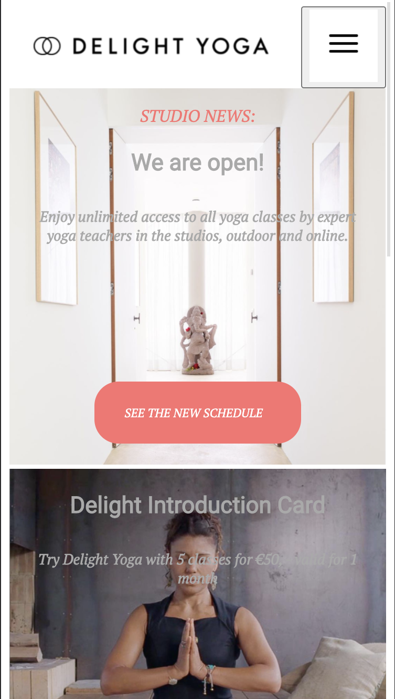
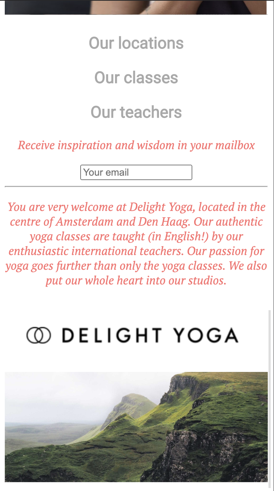
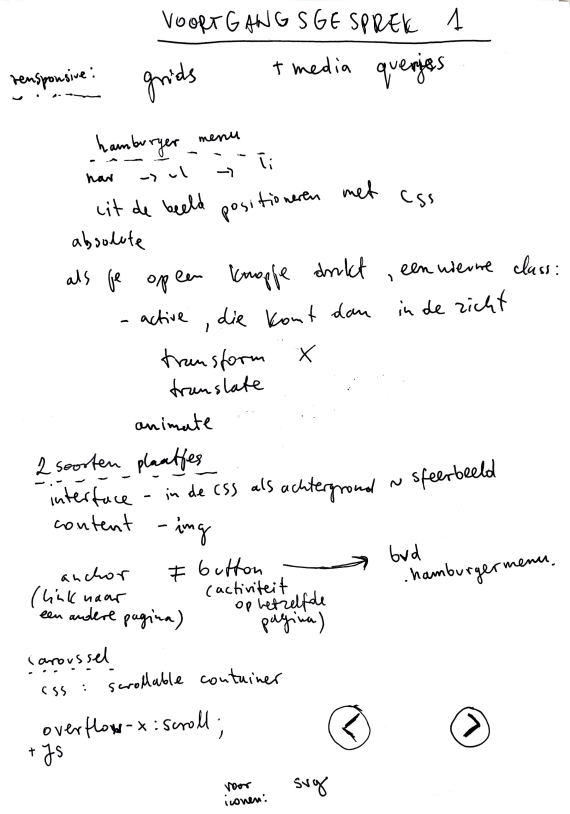
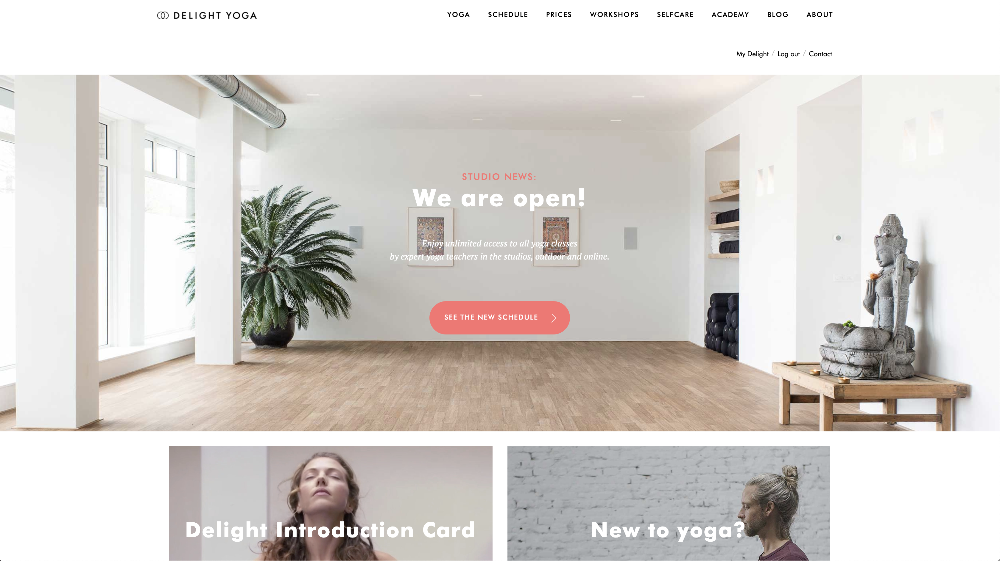
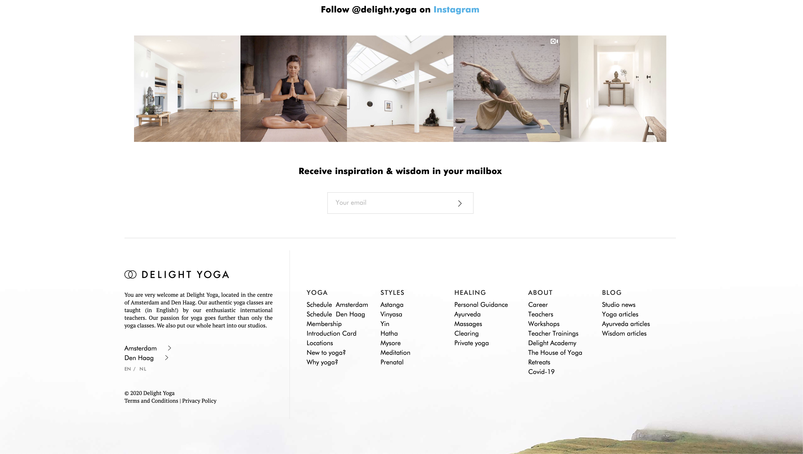

# Procesverslag
**Auteur:** Aleksandra Pawelec

Markdown cheat cheet: [Hulp bij het schrijven van Markdown](https://github.com/adam-p/markdown-here/wiki/Markdown-Cheatsheet). Nb. de standaardstructuur en de spartaanse opmaak zijn helemaal prima. Het gaat om de inhoud van je procesverslag. Besteedt de tijd voor pracht en praal aan je website.

## Bronnenlijst
1. -bron 1-
2. -bron 2-
3. -...-

## Eindgesprek (week 7/8)

-dit ging goed & dit was lastig-

**Screenshot(s):**

-screenshot(s) van je eindresultaat-

## Voortgang 3 (week 6)

-same as voortgang 1-

## Voortgang 2 (week 5)

-same as voortgang 1-

## Voortgang 1 (week 3)

### Stand van zaken

Ik vond JavaScript lastig. Het is mij nog niet gelukt om JS in mijn website te verwerken.
Ik heb nu algemeen structuur in HTML aangemaakt en de basis van CSS toegevoegd.

**Screenshot(s):**

### Agenda voor meeting
Hoe kan je (in niet te ingewikkeld manier) een caroussel maken?
Wanneer gebruik je flexbox en wanneer absoluut positioneren?
Hoe we kunnen zorgen dat de website zo responsive mogelijk wordt?
Hoe kunnen we de hamburgen menu laten werken?

### Verslag van meeting

## Intake (week 1)

**Je startniveau:** blauw

**Je focus:** surface plane 

**Je opdracht:** https://delightyoga.com/

**Screenshot(s):**

**Breakdown-schets(en):**

