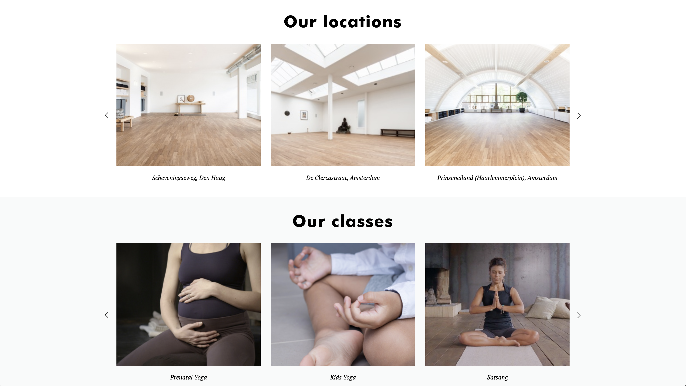

# Procesverslag
**Auteur:** Aleksandra Pawelec

## Bronnenlijst
1. https://www.w3schools.com/howto/howto_js_slideshow.asp
2. https://css-tricks.com/snippets/css/a-guide-to-flexbox/
3. -...-

## Eindgesprek (week 7/8)

-dit ging goed & dit was lastig-

Het was lastig om met JavaScript te werken. Ik heb de Inleiding Programmeren niet behaald 
en daardoor vond ik het moeilijk om dat te begrijpen. Verder vond ik de uitleg stap na stap van alle
onderdelen duidelijk en overzichtelijk. Alleen als ik dat zelf moest op mijn pagina toepassen, 
dan was het uitdagend of een keuze te maken. Hoe kan ik iets het best aanpakken? Met flexbox of grid? 
Het was ook veel bronnen bekijken om een oplossing te vinden. Het is uitindelijk gelukt om JS te gebruiken 
in hamburger menu en in de caroussel. Alleen weghalen van de JS van html (slideshow) is mij niet gelukt.
Sam, de studentenasisstent was ook heel behulpzaam.

**Screenshot(s):**

## Voortgang 3 (week 6)

### Stand van zaken

Ik heb verder gewerkt om hamburger menu en de caroussel in elkaar te krijgen. 
Er zitten nog wel bugs in. De tweede pagina moet nog gemaakt worden. Ook 
responsiveness moet ik nog uitwerken.

**Screenshot(s):**

### Agenda voor meeting

Hamburger menu en caroussel debuggen.

### Verslag van meeting

- Stuctuur beter uitwerken (h1,h2, etc.)
- CSS en JS (onclick) elementen uit HTML document halen
- In caroussel buttons ipv de links
- Sections naar articles aanpassen in de caroussel
- Een caroussel per pagina is genoeg
- Foto's in caroussel hetzelfde maat
- link naar de w3schools pagina- bron voor Caroussel
- Hamburger menu :outline aan, svg plaatje, ul maken in nav, nav top 9em, transition .25s
- handig: chrome plugin- Web developer Toolbar

## Voortgang 2 (week 5)

### Stand van zaken

Ik ben niet echt verder gekomen na de Voortgang 1. Ik vond het heel veel informatie en
ik moet nu stap voor stap alles gaan toepassen op mijn pagina.
Ik vond JavaScript lastig.

**Screenshot(s):**

### Agenda voor meeting

### Verslag van meeting

## Voortgang 1 (week 3)

### Stand van zaken

Ik vond JavaScript lastig. Het is mij nog niet gelukt om JS in mijn website te verwerken.
Ik heb nu algemeen structuur in HTML aangemaakt en de basis van CSS toegevoegd.

**Screenshot(s):**

### Agenda voor meeting
Hoe kan je (in niet te ingewikkeld manier) een caroussel maken?
Wanneer gebruik je flexbox en wanneer absoluut positioneren?
Hoe we kunnen zorgen dat de website zo responsive mogelijk wordt?
Hoe kunnen we de hamburgen menu laten werken?

### Verslag van meeting

## Intake (week 1)

**Je startniveau:** blauw

**Je focus:** surface plane 

**Je opdracht:** https://delightyoga.com/

**Screenshot(s):**

**Breakdown-schets(en):**

